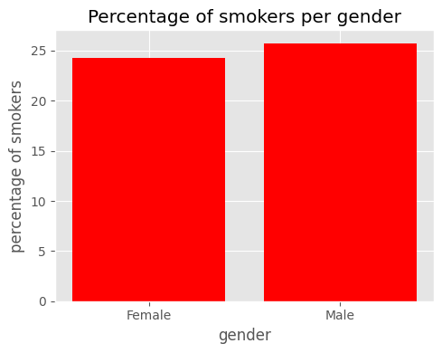
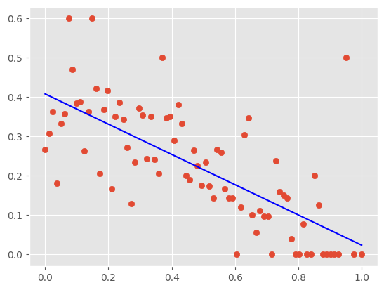
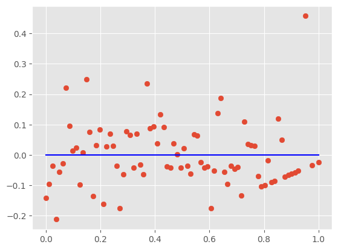
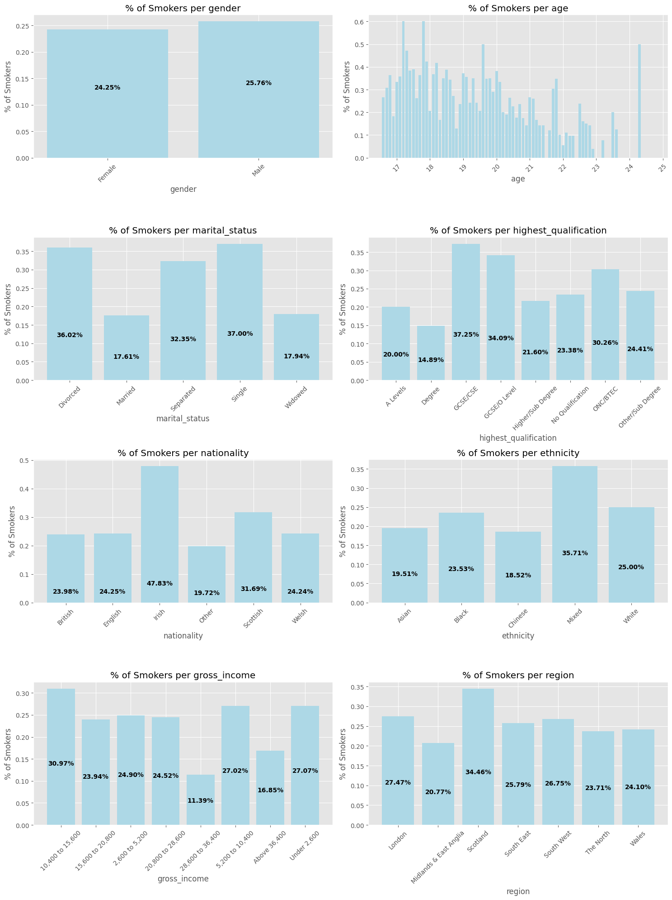
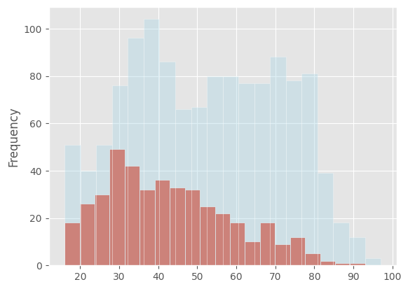
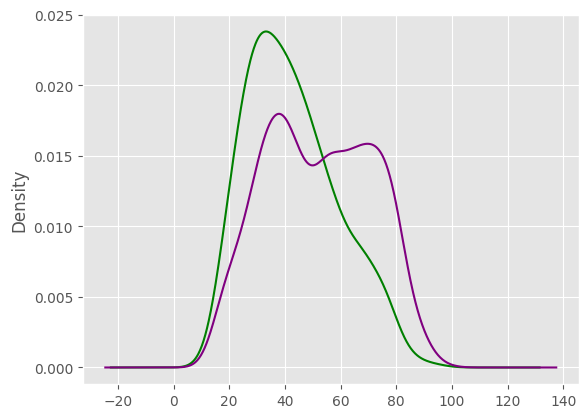
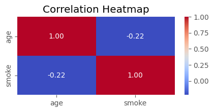

```python
# This Python 3 environment comes with many helpful analytics libraries installed
# It is defined by the kaggle/python Docker image: https://github.com/kaggle/docker-python
# For example, here's several helpful packages to load

import numpy as np # linear algebra
import pandas as pd # data processing, CSV file I/O (e.g. pd.read_csv)
import matplotlib.pyplot as plt
import seaborn as sns
import altair as alt
from scipy.stats import ttest_ind, f_oneway, normaltest
import statsmodels.api as sm
from statsmodels.formula.api import ols
import warnings

warnings.filterwarnings('ignore')

plt.style.use('ggplot')

# Input data files are available in the read-only "../input/" directory
# For example, running this (by clicking run or pressing Shift+Enter) will list all files under the input directory

import os
for dirname, _, filenames in os.walk('/kaggle/input'):
    for filename in filenames:
        print(os.path.join(dirname, filename))

# You can write up to 20GB to the current directory (/kaggle/working/) that gets preserved as output when you create a version using "Save & Run All" 
# You can also write temporary files to /kaggle/temp/, but they won't be saved outside of the current session
```

    /kaggle/input/uk-smoking-data/smoking.csv


```python
df = pd.read_csv('/kaggle/input/uk-smoking-data/smoking.csv')
```


```python
df.head()
```


<div>
<style scoped>
    .dataframe tbody tr th:only-of-type {
        vertical-align: middle;
    }

    .dataframe tbody tr th {
        vertical-align: top;
    }

    .dataframe thead th {
        text-align: right;
    }
</style>
<table border="1" class="dataframe">
  <thead>
    <tr style="text-align: right;">
      <th></th>
      <th>gender</th>
      <th>age</th>
      <th>marital_status</th>
      <th>highest_qualification</th>
      <th>nationality</th>
      <th>ethnicity</th>
      <th>gross_income</th>
      <th>region</th>
      <th>smoke</th>
      <th>amt_weekends</th>
      <th>amt_weekdays</th>
      <th>type</th>
    </tr>
  </thead>
  <tbody>
    <tr>
      <th>0</th>
      <td>Male</td>
      <td>38</td>
      <td>Divorced</td>
      <td>No Qualification</td>
      <td>British</td>
      <td>White</td>
      <td>2,600 to 5,200</td>
      <td>The North</td>
      <td>No</td>
      <td>NaN</td>
      <td>NaN</td>
      <td>NaN</td>
    </tr>
    <tr>
      <th>1</th>
      <td>Female</td>
      <td>42</td>
      <td>Single</td>
      <td>No Qualification</td>
      <td>British</td>
      <td>White</td>
      <td>Under 2,600</td>
      <td>The North</td>
      <td>Yes</td>
      <td>12.0</td>
      <td>12.0</td>
      <td>Packets</td>
    </tr>
    <tr>
      <th>2</th>
      <td>Male</td>
      <td>40</td>
      <td>Married</td>
      <td>Degree</td>
      <td>English</td>
      <td>White</td>
      <td>28,600 to 36,400</td>
      <td>The North</td>
      <td>No</td>
      <td>NaN</td>
      <td>NaN</td>
      <td>NaN</td>
    </tr>
    <tr>
      <th>3</th>
      <td>Female</td>
      <td>40</td>
      <td>Married</td>
      <td>Degree</td>
      <td>English</td>
      <td>White</td>
      <td>10,400 to 15,600</td>
      <td>The North</td>
      <td>No</td>
      <td>NaN</td>
      <td>NaN</td>
      <td>NaN</td>
    </tr>
    <tr>
      <th>4</th>
      <td>Female</td>
      <td>39</td>
      <td>Married</td>
      <td>GCSE/O Level</td>
      <td>British</td>
      <td>White</td>
      <td>2,600 to 5,200</td>
      <td>The North</td>
      <td>No</td>
      <td>NaN</td>
      <td>NaN</td>
      <td>NaN</td>
    </tr>
  </tbody>
</table>
</div>


# Some Relations I would like to discover:

1) Relationship between each factor and smoking. \
2) Which age group tends to smoke most? \
3) Do regions affect the smoking tendencies? \
4) How does ethnicity affect smoking habits? \
5) Do ethnicites relate to smoking habits differently in different regions? \
6) What about qualification? Can a higher qualification change smoking habits? \
7) Does Marital Status affect the rates of smoking in genders?


```python
df.info()
```

    <class 'pandas.core.frame.DataFrame'>
    RangeIndex: 1691 entries, 0 to 1690
    Data columns (total 12 columns):
     #   Column                 Non-Null Count  Dtype  
    ---  ------                 --------------  -----  
     0   gender                 1691 non-null   object 
     1   age                    1691 non-null   int64  
     2   marital_status         1691 non-null   object 
     3   highest_qualification  1691 non-null   object 
     4   nationality            1691 non-null   object 
     5   ethnicity              1691 non-null   object 
     6   gross_income           1691 non-null   object 
     7   region                 1691 non-null   object 
     8   smoke                  1691 non-null   object 
     9   amt_weekends           421 non-null    float64
     10  amt_weekdays           421 non-null    float64
     11  type                   421 non-null    object 
    dtypes: float64(2), int64(1), object(9)
    memory usage: 158.7+ KB


```python
df.drop(columns=['amt_weekends', 'amt_weekdays', 'type'], inplace=True)
```


```python
df.isnull().sum()
```


    gender                   0
    age                      0
    marital_status           0
    highest_qualification    0
    nationality              0
    ethnicity                0
    gross_income             0
    region                   0
    smoke                    0
    dtype: int64


```python
unique_elements = {}

for column in df.columns:
    if column != 'age':
        unique_elements[column] = df[column].unique()

unique_elements
```


    {'gender': array(['Male', 'Female'], dtype=object),
     'marital_status': array(['Divorced', 'Single', 'Married', 'Widowed', 'Separated'],
           dtype=object),
     'highest_qualification': array(['No Qualification', 'Degree', 'GCSE/O Level', 'GCSE/CSE',
            'Other/Sub Degree', 'Higher/Sub Degree', 'ONC/BTEC', 'A Levels'],
           dtype=object),
     'nationality': array(['British', 'English', 'Scottish', 'Other', 'Welsh', 'Irish',
            'Refused', 'Unknown'], dtype=object),
     'ethnicity': array(['White', 'Mixed', 'Black', 'Refused', 'Asian', 'Chinese',
            'Unknown'], dtype=object),
     'gross_income': array(['2,600 to 5,200', 'Under 2,600', '28,600 to 36,400',
            '10,400 to 15,600', '15,600 to 20,800', 'Above 36,400',
            '5,200 to 10,400', 'Refused', '20,800 to 28,600', 'Unknown'],
           dtype=object),
     'region': array(['The North', 'Midlands & East Anglia', 'London', 'South East',
            'South West', 'Wales', 'Scotland'], dtype=object),
     'smoke': array(['No', 'Yes'], dtype=object)}


```python
def parse_null(table):
    table = table.copy()
    for column in table.columns:
        table[column] = table[column].apply(func=lambda x: np.nan if x in ['Refused', 'Unknown'] else x)
    return table
```


```python
df = parse_null(df).copy()
```


```python
df.info()
```

    <class 'pandas.core.frame.DataFrame'>
    RangeIndex: 1691 entries, 0 to 1690
    Data columns (total 9 columns):
     #   Column                 Non-Null Count  Dtype 
    ---  ------                 --------------  ----- 
     0   gender                 1691 non-null   object
     1   age                    1691 non-null   int64 
     2   marital_status         1691 non-null   object
     3   highest_qualification  1691 non-null   object
     4   nationality            1673 non-null   object
     5   ethnicity              1676 non-null   object
     6   gross_income           1565 non-null   object
     7   region                 1691 non-null   object
     8   smoke                  1691 non-null   object
    dtypes: int64(1), object(8)
    memory usage: 119.0+ KB


# Relationship between each factor and smoking


```python
# Transforming the smoke column into 0 and 1.

df['smoke'] = df['smoke'].apply(func=lambda x: 1 if x == 'Yes' else 0)
```


```python
# Relationship between gender and smoking.

gender_smoking_data = df.groupby('gender').agg({
    'smoke': 'mean'
}).reset_index()

plt.figure(figsize=(5, 4))
plt.bar(gender_smoking_data['gender'], 100*gender_smoking_data['smoke'], color='red')
plt.title('Percentage of smokers per gender')
plt.xlabel('gender')
plt.ylabel('percentage of smokers')
plt.tight_layout()

plt.show()
```


    

    


```python

```

#### If we let $\bar{X}$ and $\bar{Y}$ be the sample proportions of smokers for males and females, respectively, and if we assume $X \rightarrow \mathcal{S_1}(\mu_{male}, \sigma_{male}^2)$ and $Y \rightarrow \mathcal{S_2}(\mu_{female}, \sigma_{female}^2)$ for some probability distributions $\mathcal{S_1}$ and $\mathcal{S_2}$, then by the Central Limit Theorem the proportions are approximately normal with  $\bar{X} \rightarrow \mathcal{N}(\mu_{male}, \displaystyle\frac{\sigma_{male}^2}{n_{male}})$ and $\bar{Y} \rightarrow \mathcal{N}(\mu_{female}, \displaystyle\frac{\sigma_{female}^2}{n_{female}})$.

#### We now aim to test whether there are truly some differences between the means. Since we're dealing with two means, we will use a t - test at the 5% siginificance level (We can already see that most probably no pronounced differences exist, but we will test this nonetheless).


```python
male_smoke = df['smoke'][df['gender'] == 'Male']
female_smoke = df['smoke'][df['gender'] == 'Female']

t_statistic, p_value = ttest_ind(male_smoke, female_smoke)

print(f"t statistic: {t_statistic}")
print(f"p value: {p_value}")
```

    t statistic: 0.7099386350313722
    p value: 0.47784019123747823


#### Since the p_value is much greater than our chosen 5% significance level, we can deduce that no statistical evidence suggests that we should reject the null.

#### We will now attempt to do the same for the other factors.


```python
df.head()
```


<div>
<style scoped>
    .dataframe tbody tr th:only-of-type {
        vertical-align: middle;
    }

    .dataframe tbody tr th {
        vertical-align: top;
    }

    .dataframe thead th {
        text-align: right;
    }
</style>
<table border="1" class="dataframe">
  <thead>
    <tr style="text-align: right;">
      <th></th>
      <th>gender</th>
      <th>age</th>
      <th>marital_status</th>
      <th>highest_qualification</th>
      <th>nationality</th>
      <th>ethnicity</th>
      <th>gross_income</th>
      <th>region</th>
      <th>smoke</th>
    </tr>
  </thead>
  <tbody>
    <tr>
      <th>0</th>
      <td>Male</td>
      <td>38</td>
      <td>Divorced</td>
      <td>No Qualification</td>
      <td>British</td>
      <td>White</td>
      <td>2,600 to 5,200</td>
      <td>The North</td>
      <td>0</td>
    </tr>
    <tr>
      <th>1</th>
      <td>Female</td>
      <td>42</td>
      <td>Single</td>
      <td>No Qualification</td>
      <td>British</td>
      <td>White</td>
      <td>Under 2,600</td>
      <td>The North</td>
      <td>1</td>
    </tr>
    <tr>
      <th>2</th>
      <td>Male</td>
      <td>40</td>
      <td>Married</td>
      <td>Degree</td>
      <td>English</td>
      <td>White</td>
      <td>28,600 to 36,400</td>
      <td>The North</td>
      <td>0</td>
    </tr>
    <tr>
      <th>3</th>
      <td>Female</td>
      <td>40</td>
      <td>Married</td>
      <td>Degree</td>
      <td>English</td>
      <td>White</td>
      <td>10,400 to 15,600</td>
      <td>The North</td>
      <td>0</td>
    </tr>
    <tr>
      <th>4</th>
      <td>Female</td>
      <td>39</td>
      <td>Married</td>
      <td>GCSE/O Level</td>
      <td>British</td>
      <td>White</td>
      <td>2,600 to 5,200</td>
      <td>The North</td>
      <td>0</td>
    </tr>
  </tbody>
</table>
</div>


```python
unique_elements_len = {list(unique_elements.keys())[i]: len(list(unique_elements.values())[i]) for i in range(len(unique_elements))}
```


```python
f_statistic, p_value = f_oneway(*[df['smoke'][df['region'] == status] for status in unique_elements['region']])

print(f_statistic)
print(p_value)
```

    2.1189310387572067
    0.04839328920425179


```python
temp = \
df.groupby('age').agg({
    'smoke': 'mean'
}).reset_index()

standarized_temp_age = (temp['age'] - np.min(temp['age']))/(np.max(temp['age']) - np.min(temp['age']))

b1, b0 = np.polyfit(standarized_temp_age, temp['smoke'], 1)
x_ = np.linspace(0, 1, 1000)
y_ = b0 + b1*x_

plt.scatter(standarized_temp_age, temp['smoke'])
plt.plot(x_, y_, color='blue')
```


    [<matplotlib.lines.Line2D at 0x79e0f2e58b80>]


    

    


```python
plt.scatter(standarized_temp_age, temp['smoke'] - (b0 + b1*standarized_temp_age))
plt.plot(np.linspace(0, 1, 200), [0]*200, color='blue')
```


    [<matplotlib.lines.Line2D at 0x79e0f2fb67a0>]


    

    


```python
from sklearn.metrics import mean_squared_error

x_ = standarized_temp_age
y_ = b0 + b1*x_
y_t = temp['smoke']

np.sqrt(mean_squared_error(y_, y_t))
```


    0.10558383182842818


```python
df_marital_status = df.groupby('marital_status')['smoke'].mean().reset_index()

model = ols("smoke ~ C(marital_status)", data=df[['marital_status', 'smoke']]).fit()
anova_table = sm.stats.anova_lm(model, typ=2)
```


```python
print(anova_table)
print("--------------------")
print(f"R^2: {model.rsquared}")
```

                           sum_sq      df          F        PR(>F)
    C(marital_status)   14.019832     4.0  19.556674  9.542803e-16
    Residual           302.165857  1686.0        NaN           NaN
    --------------------
    R^2: 0.04434050019347069


```python
fig, axs = plt.subplots(4, 2, figsize=(15, 20), constrained_layout=True)
columns = df.columns

for i in range(len(columns)):
    if columns[i] != 'smoke':
        table = df.groupby(columns[i]).agg({
            'smoke': 'mean'
        }).reset_index()

        bars = axs[i // 2][i % 2].bar(table[columns[i]], table['smoke'], color='lightblue')
        axs[i // 2][i % 2].set_xticklabels(table[columns[i]], rotation=45)
        axs[i // 2][i % 2].set_title(f'% of Smokers per {columns[i]}')
        axs[i // 2][i % 2].set_ylabel('% of Smokers')
        axs[i // 2][i % 2].set_xlabel(f'{columns[i]}')
        
        if columns[i] != 'age':
            for bar in bars:
                height = bar.get_height()
                axs[i // 2][i % 2].annotate(f'{100*height:.2f}%', 
                                           xy=(bar.get_x() + bar.get_width() / 2, height),
                                           xytext=(0, -height*400),
                                           textcoords="offset points",
                                           ha='center', va='bottom',
                                           weight='bold')

plt.tight_layout()
plt.show()
```


    

    


#### If we let $\bar{X}$ be the sample proportion of smokers for any of the given features, and if we assume $X \rightarrow \mathcal{S}(\mu, \sigma^2)$ for some probability distribution $\mathcal{S}$, then by the Central Limit Theorem the sample proportion is approximately normal with $\bar{X} \rightarrow \mathcal{N}(\mu, \displaystyle\frac{\sigma^2}{n})$, where $n$ is the sample size.


```python
df.describe()
```


<div>
<style scoped>
    .dataframe tbody tr th:only-of-type {
        vertical-align: middle;
    }

    .dataframe tbody tr th {
        vertical-align: top;
    }

    .dataframe thead th {
        text-align: right;
    }
</style>
<table border="1" class="dataframe">
  <thead>
    <tr style="text-align: right;">
      <th></th>
      <th>age</th>
      <th>smoke</th>
    </tr>
  </thead>
  <tbody>
    <tr>
      <th>count</th>
      <td>1691.000000</td>
      <td>1691.000000</td>
    </tr>
    <tr>
      <th>mean</th>
      <td>49.836192</td>
      <td>0.248965</td>
    </tr>
    <tr>
      <th>std</th>
      <td>18.736851</td>
      <td>0.432541</td>
    </tr>
    <tr>
      <th>min</th>
      <td>16.000000</td>
      <td>0.000000</td>
    </tr>
    <tr>
      <th>25%</th>
      <td>34.000000</td>
      <td>0.000000</td>
    </tr>
    <tr>
      <th>50%</th>
      <td>48.000000</td>
      <td>0.000000</td>
    </tr>
    <tr>
      <th>75%</th>
      <td>65.500000</td>
      <td>0.000000</td>
    </tr>
    <tr>
      <th>max</th>
      <td>97.000000</td>
      <td>1.000000</td>
    </tr>
  </tbody>
</table>
</div>


```python
df['age'][df['smoke'] == 1].plot(kind='hist', bins=20, edgecolor="white")
df['age'][df['smoke'] == 0].plot(kind='hist', bins=20, edgecolor="white", alpha=0.4, color='lightblue')
```


    <Axes: ylabel='Frequency'>


    

    


```python
df['age'][df['smoke'] == 1].plot(kind='kde', color='green')
df['age'][df['smoke'] == 0].plot(kind='kde', color='purple')
```


    <Axes: ylabel='Density'>


    

    


```python
df
```


<div>
<style scoped>
    .dataframe tbody tr th:only-of-type {
        vertical-align: middle;
    }

    .dataframe tbody tr th {
        vertical-align: top;
    }

    .dataframe thead th {
        text-align: right;
    }
</style>
<table border="1" class="dataframe">
  <thead>
    <tr style="text-align: right;">
      <th></th>
      <th>gender</th>
      <th>age</th>
      <th>marital_status</th>
      <th>highest_qualification</th>
      <th>nationality</th>
      <th>ethnicity</th>
      <th>gross_income</th>
      <th>region</th>
      <th>smoke</th>
    </tr>
  </thead>
  <tbody>
    <tr>
      <th>0</th>
      <td>Male</td>
      <td>38</td>
      <td>Divorced</td>
      <td>No Qualification</td>
      <td>British</td>
      <td>White</td>
      <td>2,600 to 5,200</td>
      <td>The North</td>
      <td>0</td>
    </tr>
    <tr>
      <th>1</th>
      <td>Female</td>
      <td>42</td>
      <td>Single</td>
      <td>No Qualification</td>
      <td>British</td>
      <td>White</td>
      <td>Under 2,600</td>
      <td>The North</td>
      <td>1</td>
    </tr>
    <tr>
      <th>2</th>
      <td>Male</td>
      <td>40</td>
      <td>Married</td>
      <td>Degree</td>
      <td>English</td>
      <td>White</td>
      <td>28,600 to 36,400</td>
      <td>The North</td>
      <td>0</td>
    </tr>
    <tr>
      <th>3</th>
      <td>Female</td>
      <td>40</td>
      <td>Married</td>
      <td>Degree</td>
      <td>English</td>
      <td>White</td>
      <td>10,400 to 15,600</td>
      <td>The North</td>
      <td>0</td>
    </tr>
    <tr>
      <th>4</th>
      <td>Female</td>
      <td>39</td>
      <td>Married</td>
      <td>GCSE/O Level</td>
      <td>British</td>
      <td>White</td>
      <td>2,600 to 5,200</td>
      <td>The North</td>
      <td>0</td>
    </tr>
    <tr>
      <th>...</th>
      <td>...</td>
      <td>...</td>
      <td>...</td>
      <td>...</td>
      <td>...</td>
      <td>...</td>
      <td>...</td>
      <td>...</td>
      <td>...</td>
    </tr>
    <tr>
      <th>1686</th>
      <td>Male</td>
      <td>22</td>
      <td>Single</td>
      <td>No Qualification</td>
      <td>Scottish</td>
      <td>White</td>
      <td>2,600 to 5,200</td>
      <td>Scotland</td>
      <td>0</td>
    </tr>
    <tr>
      <th>1687</th>
      <td>Female</td>
      <td>49</td>
      <td>Divorced</td>
      <td>Other/Sub Degree</td>
      <td>English</td>
      <td>White</td>
      <td>2,600 to 5,200</td>
      <td>Scotland</td>
      <td>1</td>
    </tr>
    <tr>
      <th>1688</th>
      <td>Male</td>
      <td>45</td>
      <td>Married</td>
      <td>Other/Sub Degree</td>
      <td>Scottish</td>
      <td>White</td>
      <td>5,200 to 10,400</td>
      <td>Scotland</td>
      <td>0</td>
    </tr>
    <tr>
      <th>1689</th>
      <td>Female</td>
      <td>51</td>
      <td>Married</td>
      <td>No Qualification</td>
      <td>English</td>
      <td>White</td>
      <td>2,600 to 5,200</td>
      <td>Scotland</td>
      <td>1</td>
    </tr>
    <tr>
      <th>1690</th>
      <td>Male</td>
      <td>31</td>
      <td>Married</td>
      <td>Degree</td>
      <td>Scottish</td>
      <td>White</td>
      <td>10,400 to 15,600</td>
      <td>Scotland</td>
      <td>0</td>
    </tr>
  </tbody>
</table>
<p>1691 rows × 9 columns</p>
</div>


```python
plt.figure(figsize=(5, 2))
sns.heatmap(df[['age', 'smoke']].corr(), annot=True, cmap='coolwarm', fmt=".2f")
plt.title('Correlation Heatmap')
plt.show()
```


    

    


```python
df.describe(include='all').replace({np.nan: '---'})
```


<div>
<style scoped>
    .dataframe tbody tr th:only-of-type {
        vertical-align: middle;
    }

    .dataframe tbody tr th {
        vertical-align: top;
    }

    .dataframe thead th {
        text-align: right;
    }
</style>
<table border="1" class="dataframe">
  <thead>
    <tr style="text-align: right;">
      <th></th>
      <th>gender</th>
      <th>age</th>
      <th>marital_status</th>
      <th>highest_qualification</th>
      <th>nationality</th>
      <th>ethnicity</th>
      <th>gross_income</th>
      <th>region</th>
      <th>smoke</th>
    </tr>
  </thead>
  <tbody>
    <tr>
      <th>count</th>
      <td>1691</td>
      <td>1691.0</td>
      <td>1691</td>
      <td>1691</td>
      <td>1673</td>
      <td>1676</td>
      <td>1565</td>
      <td>1691</td>
      <td>1691.0</td>
    </tr>
    <tr>
      <th>unique</th>
      <td>2</td>
      <td>---</td>
      <td>5</td>
      <td>8</td>
      <td>6</td>
      <td>5</td>
      <td>8</td>
      <td>7</td>
      <td>---</td>
    </tr>
    <tr>
      <th>top</th>
      <td>Female</td>
      <td>---</td>
      <td>Married</td>
      <td>No Qualification</td>
      <td>English</td>
      <td>White</td>
      <td>5,200 to 10,400</td>
      <td>Midlands &amp; East Anglia</td>
      <td>---</td>
    </tr>
    <tr>
      <th>freq</th>
      <td>965</td>
      <td>---</td>
      <td>812</td>
      <td>586</td>
      <td>833</td>
      <td>1560</td>
      <td>396</td>
      <td>443</td>
      <td>---</td>
    </tr>
    <tr>
      <th>mean</th>
      <td>---</td>
      <td>49.836192</td>
      <td>---</td>
      <td>---</td>
      <td>---</td>
      <td>---</td>
      <td>---</td>
      <td>---</td>
      <td>0.248965</td>
    </tr>
    <tr>
      <th>std</th>
      <td>---</td>
      <td>18.736851</td>
      <td>---</td>
      <td>---</td>
      <td>---</td>
      <td>---</td>
      <td>---</td>
      <td>---</td>
      <td>0.432541</td>
    </tr>
    <tr>
      <th>min</th>
      <td>---</td>
      <td>16.0</td>
      <td>---</td>
      <td>---</td>
      <td>---</td>
      <td>---</td>
      <td>---</td>
      <td>---</td>
      <td>0.0</td>
    </tr>
    <tr>
      <th>25%</th>
      <td>---</td>
      <td>34.0</td>
      <td>---</td>
      <td>---</td>
      <td>---</td>
      <td>---</td>
      <td>---</td>
      <td>---</td>
      <td>0.0</td>
    </tr>
    <tr>
      <th>50%</th>
      <td>---</td>
      <td>48.0</td>
      <td>---</td>
      <td>---</td>
      <td>---</td>
      <td>---</td>
      <td>---</td>
      <td>---</td>
      <td>0.0</td>
    </tr>
    <tr>
      <th>75%</th>
      <td>---</td>
      <td>65.5</td>
      <td>---</td>
      <td>---</td>
      <td>---</td>
      <td>---</td>
      <td>---</td>
      <td>---</td>
      <td>0.0</td>
    </tr>
    <tr>
      <th>max</th>
      <td>---</td>
      <td>97.0</td>
      <td>---</td>
      <td>---</td>
      <td>---</td>
      <td>---</td>
      <td>---</td>
      <td>---</td>
      <td>1.0</td>
    </tr>
  </tbody>
</table>
</div>


```python

```
