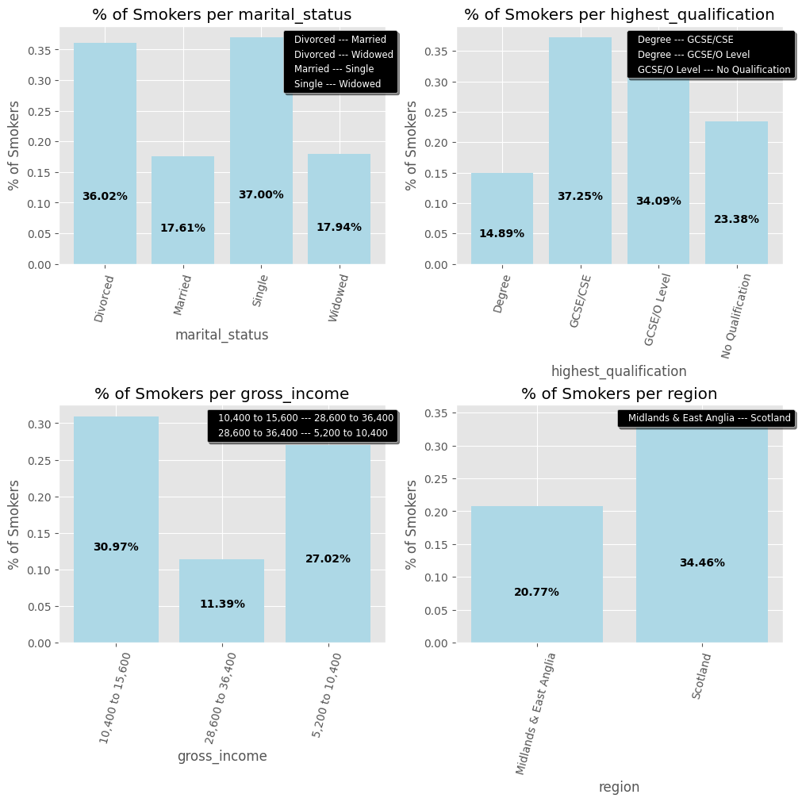
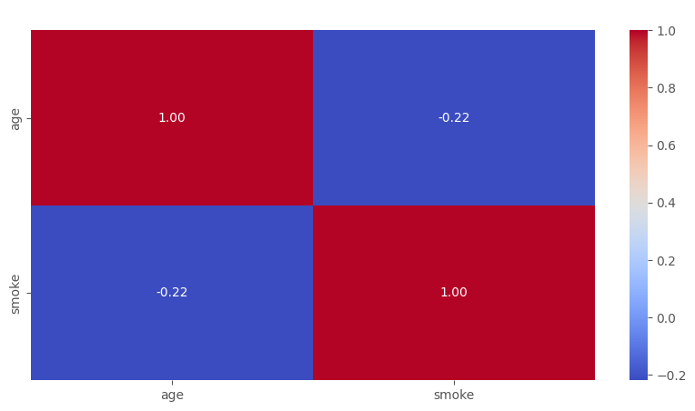
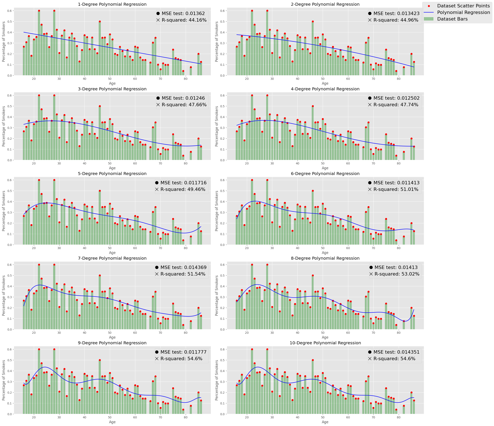
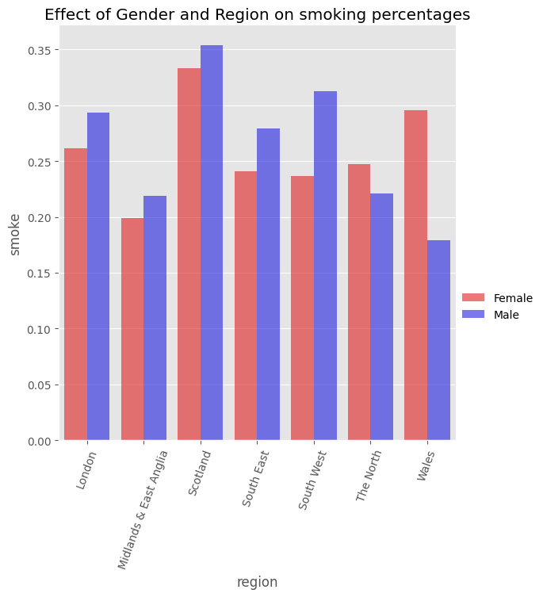
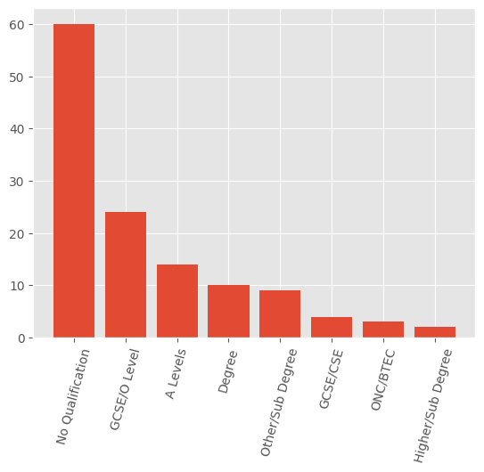

# Analysing factors behind smoking in the UK

In this project, we examine smoking habits of individuals in the UK by considering multiple factors such as gender, age, academic qualifications and ethnicity (among some more few). The goal is to get as many insights out of this dataset.

### Source

I got ths dataset from kaggle

### Technologies and Data Analytics skills used in this project

Description here...
____________________________________________
# Importing Libraries


```python
import numpy as np
import pandas as pd
from IPython.display import display, Markdown
import matplotlib.pyplot as plt
import seaborn as sns
from scipy.stats import gaussian_kde
import statsmodels.api as sm
from statsmodels.stats.multicomp import pairwise_tukeyhsd
from sklearn.model_selection import train_test_split
import pingouin as pg
import warnings

warnings.filterwarnings('ignore')
plt.style.use('ggplot')
plt.rcParams['legend.labelcolor'] = 'black'
```


```python
df = pd.read_csv(r'C:\Users\User\Desktop\smoking.csv')
```


```python
df.head()
```


<div>
<style scoped>
    .dataframe tbody tr th:only-of-type {
        vertical-align: middle;
    }

    .dataframe tbody tr th {
        vertical-align: top;
    }

    .dataframe thead th {
        text-align: right;
    }
</style>
<table border="1" class="dataframe">
  <thead>
    <tr style="text-align: right;">
      <th></th>
      <th>Unnamed: 0</th>
      <th>gender</th>
      <th>age</th>
      <th>marital_status</th>
      <th>highest_qualification</th>
      <th>nationality</th>
      <th>ethnicity</th>
      <th>gross_income</th>
      <th>region</th>
      <th>smoke</th>
      <th>amt_weekends</th>
      <th>amt_weekdays</th>
      <th>type</th>
    </tr>
  </thead>
  <tbody>
    <tr>
      <th>0</th>
      <td>1</td>
      <td>Male</td>
      <td>38</td>
      <td>Divorced</td>
      <td>No Qualification</td>
      <td>British</td>
      <td>White</td>
      <td>2,600 to 5,200</td>
      <td>The North</td>
      <td>No</td>
      <td>NaN</td>
      <td>NaN</td>
      <td>NaN</td>
    </tr>
    <tr>
      <th>1</th>
      <td>2</td>
      <td>Female</td>
      <td>42</td>
      <td>Single</td>
      <td>No Qualification</td>
      <td>British</td>
      <td>White</td>
      <td>Under 2,600</td>
      <td>The North</td>
      <td>Yes</td>
      <td>12.0</td>
      <td>12.0</td>
      <td>Packets</td>
    </tr>
    <tr>
      <th>2</th>
      <td>3</td>
      <td>Male</td>
      <td>40</td>
      <td>Married</td>
      <td>Degree</td>
      <td>English</td>
      <td>White</td>
      <td>28,600 to 36,400</td>
      <td>The North</td>
      <td>No</td>
      <td>NaN</td>
      <td>NaN</td>
      <td>NaN</td>
    </tr>
    <tr>
      <th>3</th>
      <td>4</td>
      <td>Female</td>
      <td>40</td>
      <td>Married</td>
      <td>Degree</td>
      <td>English</td>
      <td>White</td>
      <td>10,400 to 15,600</td>
      <td>The North</td>
      <td>No</td>
      <td>NaN</td>
      <td>NaN</td>
      <td>NaN</td>
    </tr>
    <tr>
      <th>4</th>
      <td>5</td>
      <td>Female</td>
      <td>39</td>
      <td>Married</td>
      <td>GCSE/O Level</td>
      <td>British</td>
      <td>White</td>
      <td>2,600 to 5,200</td>
      <td>The North</td>
      <td>No</td>
      <td>NaN</td>
      <td>NaN</td>
      <td>NaN</td>
    </tr>
  </tbody>
</table>
</div>


# Data Cleaning and Wrangling


```python
df.info()
```

    <class 'pandas.core.frame.DataFrame'>
    RangeIndex: 1691 entries, 0 to 1690
    Data columns (total 13 columns):
     #   Column                 Non-Null Count  Dtype  
    ---  ------                 --------------  -----  
     0   Unnamed: 0             1691 non-null   int64  
     1   gender                 1691 non-null   object 
     2   age                    1691 non-null   int64  
     3   marital_status         1691 non-null   object 
     4   highest_qualification  1691 non-null   object 
     5   nationality            1691 non-null   object 
     6   ethnicity              1691 non-null   object 
     7   gross_income           1691 non-null   object 
     8   region                 1691 non-null   object 
     9   smoke                  1691 non-null   object 
     10  amt_weekends           421 non-null    float64
     11  amt_weekdays           421 non-null    float64
     12  type                   421 non-null    object 
    dtypes: float64(2), int64(2), object(9)
    memory usage: 171.9+ KB


```python
df.drop(columns=['amt_weekends', 'amt_weekdays', 'type'], inplace=True)
```


```python
df.isnull().sum()
```


    Unnamed: 0               0
    gender                   0
    age                      0
    marital_status           0
    highest_qualification    0
    nationality              0
    ethnicity                0
    gross_income             0
    region                   0
    smoke                    0
    dtype: int64


```python
unique_elements = {}

for column in df.columns:
    if column != 'age':
        unique_elements[column] = df[column].unique()

unique_elements
```


    {'Unnamed: 0': array([   1,    2,    3, ..., 1689, 1690, 1691], dtype=int64),
     'gender': array(['Male', 'Female'], dtype=object),
     'marital_status': array(['Divorced', 'Single', 'Married', 'Widowed', 'Separated'],
           dtype=object),
     'highest_qualification': array(['No Qualification', 'Degree', 'GCSE/O Level', 'GCSE/CSE',
            'Other/Sub Degree', 'Higher/Sub Degree', 'ONC/BTEC', 'A Levels'],
           dtype=object),
     'nationality': array(['British', 'English', 'Scottish', 'Other', 'Welsh', 'Irish',
            'Refused', 'Unknown'], dtype=object),
     'ethnicity': array(['White', 'Mixed', 'Black', 'Refused', 'Asian', 'Chinese',
            'Unknown'], dtype=object),
     'gross_income': array(['2,600 to 5,200', 'Under 2,600', '28,600 to 36,400',
            '10,400 to 15,600', '15,600 to 20,800', 'Above 36,400',
            '5,200 to 10,400', 'Refused', '20,800 to 28,600', 'Unknown'],
           dtype=object),
     'region': array(['The North', 'Midlands & East Anglia', 'London', 'South East',
            'South West', 'Wales', 'Scotland'], dtype=object),
     'smoke': array(['No', 'Yes'], dtype=object)}


```python
def parse_null(table):
    table = table.copy()
    for column in table.columns:
        table[column] = table[column].apply(func=lambda x: np.nan if x in ['Refused', 'Unknown'] else x)
    return table
```


```python
df = parse_null(df).copy()
```


```python
df.drop(columns=df.columns[0], inplace=True)
```


```python
# Transforming the smoke column into 0 and 1.

df['smoke'] = df['smoke'].apply(func=lambda x: 1 if x == 'Yes' else 0)
```


```python
df.describe(include='all').replace({np.nan: '---'})
```


<div>
<style scoped>
    .dataframe tbody tr th:only-of-type {
        vertical-align: middle;
    }

    .dataframe tbody tr th {
        vertical-align: top;
    }

    .dataframe thead th {
        text-align: right;
    }
</style>
<table border="1" class="dataframe">
  <thead>
    <tr style="text-align: right;">
      <th></th>
      <th>gender</th>
      <th>age</th>
      <th>marital_status</th>
      <th>highest_qualification</th>
      <th>nationality</th>
      <th>ethnicity</th>
      <th>gross_income</th>
      <th>region</th>
      <th>smoke</th>
    </tr>
  </thead>
  <tbody>
    <tr>
      <th>count</th>
      <td>1691</td>
      <td>1691.0</td>
      <td>1691</td>
      <td>1691</td>
      <td>1673</td>
      <td>1676</td>
      <td>1565</td>
      <td>1691</td>
      <td>1691.0</td>
    </tr>
    <tr>
      <th>unique</th>
      <td>2</td>
      <td>---</td>
      <td>5</td>
      <td>8</td>
      <td>6</td>
      <td>5</td>
      <td>8</td>
      <td>7</td>
      <td>---</td>
    </tr>
    <tr>
      <th>top</th>
      <td>Female</td>
      <td>---</td>
      <td>Married</td>
      <td>No Qualification</td>
      <td>English</td>
      <td>White</td>
      <td>5,200 to 10,400</td>
      <td>Midlands &amp; East Anglia</td>
      <td>---</td>
    </tr>
    <tr>
      <th>freq</th>
      <td>965</td>
      <td>---</td>
      <td>812</td>
      <td>586</td>
      <td>833</td>
      <td>1560</td>
      <td>396</td>
      <td>443</td>
      <td>---</td>
    </tr>
    <tr>
      <th>mean</th>
      <td>---</td>
      <td>49.836192</td>
      <td>---</td>
      <td>---</td>
      <td>---</td>
      <td>---</td>
      <td>---</td>
      <td>---</td>
      <td>0.248965</td>
    </tr>
    <tr>
      <th>std</th>
      <td>---</td>
      <td>18.736851</td>
      <td>---</td>
      <td>---</td>
      <td>---</td>
      <td>---</td>
      <td>---</td>
      <td>---</td>
      <td>0.432541</td>
    </tr>
    <tr>
      <th>min</th>
      <td>---</td>
      <td>16.0</td>
      <td>---</td>
      <td>---</td>
      <td>---</td>
      <td>---</td>
      <td>---</td>
      <td>---</td>
      <td>0.0</td>
    </tr>
    <tr>
      <th>25%</th>
      <td>---</td>
      <td>34.0</td>
      <td>---</td>
      <td>---</td>
      <td>---</td>
      <td>---</td>
      <td>---</td>
      <td>---</td>
      <td>0.0</td>
    </tr>
    <tr>
      <th>50%</th>
      <td>---</td>
      <td>48.0</td>
      <td>---</td>
      <td>---</td>
      <td>---</td>
      <td>---</td>
      <td>---</td>
      <td>---</td>
      <td>0.0</td>
    </tr>
    <tr>
      <th>75%</th>
      <td>---</td>
      <td>65.5</td>
      <td>---</td>
      <td>---</td>
      <td>---</td>
      <td>---</td>
      <td>---</td>
      <td>---</td>
      <td>0.0</td>
    </tr>
    <tr>
      <th>max</th>
      <td>---</td>
      <td>97.0</td>
      <td>---</td>
      <td>---</td>
      <td>---</td>
      <td>---</td>
      <td>---</td>
      <td>---</td>
      <td>1.0</td>
    </tr>
  </tbody>
</table>
</div>


# Some Relations I would like to discover:
1) Relationship between each factor and smoking. \
2) Which age group tends to smoke most? \
3) Do regions affect the smoking tendencies? \
4) How does ethnicity affect smoking habits? \
5) Do ethnicites relate to smoking habits differently in different regions? \
6) What about qualification? Can a higher qualification change smoking habits? \
7) Does Marital Status affect the rates of smoking in genders?


```python
df
```


<div>
<style scoped>
    .dataframe tbody tr th:only-of-type {
        vertical-align: middle;
    }

    .dataframe tbody tr th {
        vertical-align: top;
    }

    .dataframe thead th {
        text-align: right;
    }
</style>
<table border="1" class="dataframe">
  <thead>
    <tr style="text-align: right;">
      <th></th>
      <th>gender</th>
      <th>age</th>
      <th>marital_status</th>
      <th>highest_qualification</th>
      <th>nationality</th>
      <th>ethnicity</th>
      <th>gross_income</th>
      <th>region</th>
      <th>smoke</th>
    </tr>
  </thead>
  <tbody>
    <tr>
      <th>0</th>
      <td>Male</td>
      <td>38</td>
      <td>Divorced</td>
      <td>No Qualification</td>
      <td>British</td>
      <td>White</td>
      <td>2,600 to 5,200</td>
      <td>The North</td>
      <td>0</td>
    </tr>
    <tr>
      <th>1</th>
      <td>Female</td>
      <td>42</td>
      <td>Single</td>
      <td>No Qualification</td>
      <td>British</td>
      <td>White</td>
      <td>Under 2,600</td>
      <td>The North</td>
      <td>1</td>
    </tr>
    <tr>
      <th>2</th>
      <td>Male</td>
      <td>40</td>
      <td>Married</td>
      <td>Degree</td>
      <td>English</td>
      <td>White</td>
      <td>28,600 to 36,400</td>
      <td>The North</td>
      <td>0</td>
    </tr>
    <tr>
      <th>3</th>
      <td>Female</td>
      <td>40</td>
      <td>Married</td>
      <td>Degree</td>
      <td>English</td>
      <td>White</td>
      <td>10,400 to 15,600</td>
      <td>The North</td>
      <td>0</td>
    </tr>
    <tr>
      <th>4</th>
      <td>Female</td>
      <td>39</td>
      <td>Married</td>
      <td>GCSE/O Level</td>
      <td>British</td>
      <td>White</td>
      <td>2,600 to 5,200</td>
      <td>The North</td>
      <td>0</td>
    </tr>
    <tr>
      <th>...</th>
      <td>...</td>
      <td>...</td>
      <td>...</td>
      <td>...</td>
      <td>...</td>
      <td>...</td>
      <td>...</td>
      <td>...</td>
      <td>...</td>
    </tr>
    <tr>
      <th>1686</th>
      <td>Male</td>
      <td>22</td>
      <td>Single</td>
      <td>No Qualification</td>
      <td>Scottish</td>
      <td>White</td>
      <td>2,600 to 5,200</td>
      <td>Scotland</td>
      <td>0</td>
    </tr>
    <tr>
      <th>1687</th>
      <td>Female</td>
      <td>49</td>
      <td>Divorced</td>
      <td>Other/Sub Degree</td>
      <td>English</td>
      <td>White</td>
      <td>2,600 to 5,200</td>
      <td>Scotland</td>
      <td>1</td>
    </tr>
    <tr>
      <th>1688</th>
      <td>Male</td>
      <td>45</td>
      <td>Married</td>
      <td>Other/Sub Degree</td>
      <td>Scottish</td>
      <td>White</td>
      <td>5,200 to 10,400</td>
      <td>Scotland</td>
      <td>0</td>
    </tr>
    <tr>
      <th>1689</th>
      <td>Female</td>
      <td>51</td>
      <td>Married</td>
      <td>No Qualification</td>
      <td>English</td>
      <td>White</td>
      <td>2,600 to 5,200</td>
      <td>Scotland</td>
      <td>1</td>
    </tr>
    <tr>
      <th>1690</th>
      <td>Male</td>
      <td>31</td>
      <td>Married</td>
      <td>Degree</td>
      <td>Scottish</td>
      <td>White</td>
      <td>10,400 to 15,600</td>
      <td>Scotland</td>
      <td>0</td>
    </tr>
  </tbody>
</table>
<p>1691 rows × 9 columns</p>
</div>


# Relationship between each factor and smoking


```python
fig, axs = plt.subplots(4, 2, figsize=(15, 20), constrained_layout=True)
columns = df.columns

for i in range(len(columns)):
    if columns[i] != 'smoke':
        table = df.groupby(columns[i]).agg({
            'smoke': 'mean'
        }).reset_index()

        bars = axs[i // 2][i % 2].bar(table[columns[i]], table['smoke'], color='lightblue')
        axs[i // 2][i % 2].set_xticklabels(table[columns[i]], rotation=45)
        axs[i // 2][i % 2].set_title(f'% of Smokers per {columns[i]}', color='black')
        axs[i // 2][i % 2].set_ylabel('% of Smokers')
        axs[i // 2][i % 2].set_xlabel(f'{columns[i]}')
        
        if columns[i] != 'age':
            for bar in bars:
                height = bar.get_height()
                axs[i // 2][i % 2].annotate(f'{100*height:.2f}%', 
                                           xy=(bar.get_x() + bar.get_width() / 2, height),
                                           xytext=(0, -height*400),
                                           textcoords="offset points",
                                           ha='center', va='bottom',
                                           weight='bold', color='black')

plt.tight_layout()
plt.show()
```


    

    


#### If we let $\bar{X}$ be the sample proportion of smokers for any of the given features, and if we assume $X \rightarrow \mathcal{S}(\mu, \sigma^2)$ for some probability distribution $\mathcal{S}$, then, supposing we have a sufficiently large sample size $n$, the Central Limit Theorem ensures that the sample proportion is approximately normal with $\bar{X} \rightarrow \mathcal{N}(\mu, \displaystyle\frac{\sigma^2}{n})$.

### Analysis of Categorical Variables


```python
# Conducting a Games-Howell mean difference test, assumes normal/approximately normally distributed sample means, does not contraint the variances.

columns = df.columns[~df.columns.isin(['age', 'smoke'])]

games_howell_results_by_column = { \
    column: pg.pairwise_gameshowell(data=df[[column, 'smoke']][~df[column].isna()], dv='smoke', between=column) \
    for column in columns
}

games_howell_results_by_column_rejected = {
    column: games_howell_results_by_column[column][games_howell_results_by_column[column]['pval'] < 0.05]
    for column in columns
}
```


```python
# Conducting a Tukey HSD mean difference test, assumes normal/approximately normally distributed sample means AND equal variances.


def tukey_tableau_to_df(table):
    table = table.summary().data
    table = pd.DataFrame(table)
    table.columns = table.iloc[0]
    table.drop(0, inplace=True)
    return table

tukey_results_by_column = {
    column: tukey_tableau_to_df(pairwise_tukeyhsd(df['smoke'][~df[column].isna()], df[column][~df[column].isna()]))
    for column in columns
}

tukey_results_by_column_rejected = {
    column: tukey_results_by_column[column][tukey_results_by_column[column]['reject'] == True].drop(columns='reject')
    for column in columns
}
```


```python
# Finding the columns in which the tests differed.

tukey_counter = [(column, len(tukey_results_by_column_rejected[column])) for column in columns]
games_howell_counter = [(column, len(games_howell_results_by_column_rejected[column])) for column in columns]

for i in range(7):
    if tukey_counter[i][1] != games_howell_counter[i][1]:
        print(games_howell_counter[i][0])
```

    marital_status
    gross_income


```python
tables_with_rejections = [(column, games_howell_results_by_column_rejected[column].reset_index().drop(columns='index')) for column in columns if len(games_howell_results_by_column_rejected[column]) > 0]

for table in tables_with_rejections:
    display(Markdown(f"### {table[0]}:"))
    display(table[1])
```


### marital_status:


<div>
<style scoped>
    .dataframe tbody tr th:only-of-type {
        vertical-align: middle;
    }

    .dataframe tbody tr th {
        vertical-align: top;
    }

    .dataframe thead th {
        text-align: right;
    }
</style>
<table border="1" class="dataframe">
  <thead>
    <tr style="text-align: right;">
      <th></th>
      <th>A</th>
      <th>B</th>
      <th>mean(A)</th>
      <th>mean(B)</th>
      <th>diff</th>
      <th>se</th>
      <th>T</th>
      <th>df</th>
      <th>pval</th>
      <th>hedges</th>
    </tr>
  </thead>
  <tbody>
    <tr>
      <th>0</th>
      <td>Divorced</td>
      <td>Married</td>
      <td>0.360248</td>
      <td>0.176108</td>
      <td>0.184140</td>
      <td>0.040241</td>
      <td>4.575926</td>
      <td>201.599994</td>
      <td>8.052466e-05</td>
      <td>0.460644</td>
    </tr>
    <tr>
      <th>1</th>
      <td>Divorced</td>
      <td>Widowed</td>
      <td>0.360248</td>
      <td>0.179372</td>
      <td>0.180876</td>
      <td>0.045864</td>
      <td>3.943770</td>
      <td>295.999947</td>
      <td>9.453746e-04</td>
      <td>0.421915</td>
    </tr>
    <tr>
      <th>2</th>
      <td>Married</td>
      <td>Single</td>
      <td>0.176108</td>
      <td>0.370023</td>
      <td>-0.193915</td>
      <td>0.026946</td>
      <td>-7.196341</td>
      <td>710.222661</td>
      <td>1.613243e-11</td>
      <td>-0.462328</td>
    </tr>
    <tr>
      <th>3</th>
      <td>Single</td>
      <td>Widowed</td>
      <td>0.370023</td>
      <td>0.179372</td>
      <td>0.190651</td>
      <td>0.034789</td>
      <td>5.480270</td>
      <td>545.873584</td>
      <td>6.464581e-07</td>
      <td>0.421350</td>
    </tr>
  </tbody>
</table>
</div>


### highest_qualification:


<div>
<style scoped>
    .dataframe tbody tr th:only-of-type {
        vertical-align: middle;
    }

    .dataframe tbody tr th {
        vertical-align: top;
    }

    .dataframe thead th {
        text-align: right;
    }
</style>
<table border="1" class="dataframe">
  <thead>
    <tr style="text-align: right;">
      <th></th>
      <th>A</th>
      <th>B</th>
      <th>mean(A)</th>
      <th>mean(B)</th>
      <th>diff</th>
      <th>se</th>
      <th>T</th>
      <th>df</th>
      <th>pval</th>
      <th>hedges</th>
    </tr>
  </thead>
  <tbody>
    <tr>
      <th>0</th>
      <td>Degree</td>
      <td>GCSE/CSE</td>
      <td>0.148855</td>
      <td>0.372549</td>
      <td>-0.223694</td>
      <td>0.052914</td>
      <td>-4.227535</td>
      <td>145.336796</td>
      <td>0.001061</td>
      <td>-0.562375</td>
    </tr>
    <tr>
      <th>1</th>
      <td>Degree</td>
      <td>GCSE/O Level</td>
      <td>0.148855</td>
      <td>0.340909</td>
      <td>-0.192054</td>
      <td>0.034890</td>
      <td>-5.504545</td>
      <td>559.686618</td>
      <td>0.000002</td>
      <td>-0.451726</td>
    </tr>
    <tr>
      <th>2</th>
      <td>GCSE/O Level</td>
      <td>No Qualification</td>
      <td>0.340909</td>
      <td>0.233788</td>
      <td>0.107121</td>
      <td>0.032220</td>
      <td>3.324715</td>
      <td>565.661377</td>
      <td>0.021038</td>
      <td>0.242213</td>
    </tr>
  </tbody>
</table>
</div>


### gross_income:


<div>
<style scoped>
    .dataframe tbody tr th:only-of-type {
        vertical-align: middle;
    }

    .dataframe tbody tr th {
        vertical-align: top;
    }

    .dataframe thead th {
        text-align: right;
    }
</style>
<table border="1" class="dataframe">
  <thead>
    <tr style="text-align: right;">
      <th></th>
      <th>A</th>
      <th>B</th>
      <th>mean(A)</th>
      <th>mean(B)</th>
      <th>diff</th>
      <th>se</th>
      <th>T</th>
      <th>df</th>
      <th>pval</th>
      <th>hedges</th>
    </tr>
  </thead>
  <tbody>
    <tr>
      <th>0</th>
      <td>10,400 to 15,600</td>
      <td>28,600 to 36,400</td>
      <td>0.309701</td>
      <td>0.113924</td>
      <td>0.195777</td>
      <td>0.045770</td>
      <td>4.277442</td>
      <td>183.818320</td>
      <td>0.000785</td>
      <td>0.449129</td>
    </tr>
    <tr>
      <th>1</th>
      <td>28,600 to 36,400</td>
      <td>5,200 to 10,400</td>
      <td>0.113924</td>
      <td>0.270202</td>
      <td>-0.156278</td>
      <td>0.042348</td>
      <td>-3.690285</td>
      <td>145.507452</td>
      <td>0.007444</td>
      <td>-0.365789</td>
    </tr>
  </tbody>
</table>
</div>


### region:


<div>
<style scoped>
    .dataframe tbody tr th:only-of-type {
        vertical-align: middle;
    }

    .dataframe tbody tr th {
        vertical-align: top;
    }

    .dataframe thead th {
        text-align: right;
    }
</style>
<table border="1" class="dataframe">
  <thead>
    <tr style="text-align: right;">
      <th></th>
      <th>A</th>
      <th>B</th>
      <th>mean(A)</th>
      <th>mean(B)</th>
      <th>diff</th>
      <th>se</th>
      <th>T</th>
      <th>df</th>
      <th>pval</th>
      <th>hedges</th>
    </tr>
  </thead>
  <tbody>
    <tr>
      <th>0</th>
      <td>Midlands &amp; East Anglia</td>
      <td>Scotland</td>
      <td>0.207675</td>
      <td>0.344595</td>
      <td>-0.13692</td>
      <td>0.043688</td>
      <td>-3.134014</td>
      <td>222.523544</td>
      <td>0.031689</td>
      <td>-0.321857</td>
    </tr>
  </tbody>
</table>
</div>


## Relevant Bar Charts


```python
fig, axs = plt.subplots(2, 2, figsize=(10, 10), constrained_layout=True)

for i in range(len(tables_with_rejections)):
    relevant_table = df[df[tables_with_rejections[i][0]].isin(set(tables_with_rejections[i][1]['A'].values) | set(tables_with_rejections[i][1]['B'].values))] \
    .groupby(tables_with_rejections[i][0]).agg({ \
        'smoke': 'mean' \
    }).reset_index()

    a, b = [i // 2, i % 2]
    bars = axs[a, b].bar(relevant_table[tables_with_rejections[i][0]], relevant_table['smoke'], color='lightblue')

    axs[a, b].set_title(f'% of Smokers per {tables_with_rejections[i][0]}', color='black')
    axs[a, b].set_xticklabels(axs[a, b].get_xticklabels(), rotation=75)
    axs[a, b].set_xlabel(tables_with_rejections[i][0])
    axs[a, b].set_ylabel('% of Smokers')

    for bar in bars:
        height = bar.get_height()
        axs[a, b].annotate(f'{100*height:.2f}%', 
                    xy=(bar.get_x() + bar.get_width() / 2, height),
                    xytext=(0, -height*400),
                    textcoords="offset points",
                    ha='center', va='bottom',
                    weight='bold', color='black')

    legend_handles = [plt.bar([], [], color='black', label=f"{tables_with_rejections[i][1]['A'].iloc[j]} --- {tables_with_rejections[i][1]['B'].iloc[j]}") \
                    for j in range(len(tables_with_rejections[i][1]))]

    axs[a, b].legend(handles=legend_handles, loc='upper right', bbox_to_anchor=(1.05, 1), fancybox=True, shadow=True, fontsize='small', facecolor='black', handlelength=0,
                     labelcolor = 'white')

plt.show()

```


    

    


#### These are now (most probably) expressive of actual discrepancies in smokers distribution. The provided legends provide the statistically significant mean differences.

# Dealing with Age


```python
plt.figure(figsize=(10, 5))
sns.heatmap(df[['age', 'smoke']].corr(), annot=True, cmap='coolwarm', fmt=".2f")
plt.title('Correlation Heatmap')
plt.show()
```


    

    


```python
def linear_regression_test_mse(X, y, degree, test_size=0.2, random_state=42):
    x_train, x_test, y_train, y_test = train_test_split(X, y, test_size=test_size, random_state=random_state)

    linear_regression_coefficients = np.polyfit(x_train, y_train, degree)
    linear_regression = np.poly1d(linear_regression_coefficients)
    y_test_pred = linear_regression(x_test)

    mse_test = np.mean((y_test_pred- y_test)**2)
    return np.round(mse_test, 6)


def linear_regression_rsquared(X, y, y_pred):
    SSR = sum((y_pred - np.mean(y))**2)
    SST = sum((y - np.mean(y))**2)
    
    return np.round(SSR/SST, 4)


temp = \
df.groupby('age').agg({
    'smoke': 'mean'
}).reset_index()

temp = temp[~(temp['smoke'] == 0)][:-1] # age 93 produces a very large reading, for which I consider an outlier

fig, axs = plt.subplots(5, 2, figsize=(20, 20), constrained_layout=True)
for i in range(10):
    a, b = [i // 2, i % 2]
    axs[a, b].bar(temp['age'], temp['smoke'], color='green', alpha=0.35, label='Dataset Bars')
    axs[a, b].scatter(temp['age'], temp['smoke'], color='red', label='Dataset Scatter Points')

    coefficients = np.polyfit(temp['age'], temp['smoke'], i + 1)
    N_regression = np.poly1d(coefficients)
    rsquared = linear_regression_rsquared(temp['age'], temp['smoke'], N_regression(temp['age']))
    mse_test = linear_regression_test_mse(temp['age'], temp['smoke'], i + 1)
    
    x_values = np.linspace(min(temp['age']), max(temp['age']), 1000)
    y_values = N_regression(x_values)
    
    axs[a, b].plot(x_values, y_values, color='blue', label=f'Polynomial Regression')
    axs[a, b].set_xlabel('Age')
    axs[a, b].set_ylabel('Percentage of Smokers')
    axs[a, b].set_title(f'{i + 1}-Degree Polynomial Regression', color='black')

    axs[a, b].legend(handles=[ \
        plt.Line2D([0], [0], color='black', marker='o', markersize=10, label=f'MSE test: {mse_test}', linestyle='None'), \
        plt.Line2D([0], [0], color='black', marker='x', markersize=10, label=f'R-squared: {str(100*rsquared)[:5]}%', linestyle='None')
    ], fontsize=16, handlelength=0)
    axs[a, b].grid(True)

handles, labels = axs[0, 0].get_legend_handles_labels()
fig.legend(handles, labels, loc='upper right', bbox_to_anchor=(1.16, 1), borderaxespad=0.1, fontsize=16)

plt.subplots_adjust(top=0.9, bottom=0.2)
plt.show()
```


    

    


#### +-+-+-+-+-+-+-+-+-+-+-+-+-+-+-+-+-+-+-+-+-+-+-+-+-+-+-+-+-+-+-+-+-+-+-+-+-+-+-+-+-+-+-+-+-+-+-+-+-+-+-+-+-+-+-+-+-+-+-+


```python
foopa = \
df.groupby(['gender', 'region']).agg({
    'smoke': 'mean'
}).reset_index()

plt.figure(figsize=(5, 5))
sns.catplot( 
    data=foopa, kind="bar",
    x="region", y="smoke", hue="gender",
    errorbar=None, palette=["red", 'blue'], alpha=.6, height=6,
)
plt.xticks(rotation=70)
plt.title("Effect of Gender and Region on smoking percentages", color='black')
plt.show()
```


    <Figure size 500x500 with 0 Axes>


    

    


```python
# Of those who did not report their gross income, the majority had no qualifications

qoflatoplex = df[['highest_qualification']][df['gross_income'].isnull()].value_counts().reset_index()
qoflatoplex = pd.DataFrame(qoflatoplex.values, columns=['highest_qualification', 'count'])
plt.bar(qoflatoplex['highest_qualification'], qoflatoplex['count'])
plt.xticks(rotation=75)
plt.show()
```


    

    


```python

```
